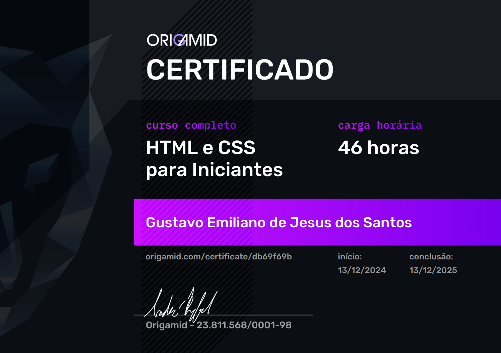

<div align="center">
      <br><br>
</div>


# **🚴‍♂️ Bikcraft Web Site**

A web page project for a fictional bicycle shop, developed with **HTML5**, **CSS3**, and **JavaScript**, focusing on front-end best practices, semantic markup, responsiveness, and code organization.

This project was developed throughout the **HTML** and **CSS** course at **<a href="https://www.origamid.com/">Origamid</a>**, as part of the learning process and consolidation of fundamental web development concepts covered during the course.

<br>
<div align="center">
  <strong>Home interface of the project</strong><br><br>
  
</div>
<br>


## **📌 About the Project**

**Bikcraft** simulates a real website of a custom bicycle brand, containing multiple pages, full navigation, and a responsive layout.  
The main objective is to apply essential front-end concepts using only **native web technologies**, without frameworks.

## **:mag_right: Features**

✔️ Responsive layout (desktop, tablet, and mobile)

✔️ Navigation between multiple pages

✔️ Use of semantic HTML

✔️ Modern styling with CSS

✔️ Basic interactions with JavaScript

✔️ File organization following best practices


## 📁 Project Structure

The project structure was organized to facilitate maintenance, scalability, and code understanding.

```text
bikcraft/
├── assets/             # Images not directly related to the project
├── certificado/        # PDF certificate files
├── bicicletas/         # Pages related to bicycle models
├── css/                # Style files (CSS)
├── img/                # Images and project assets
├── js/                 # JavaScript scripts
├── index.html          # Home page
├── bicicletas.html     # Bicycle listing/details page
├── contato.html        # Contact page
├── orcamento.html      # Budget/quote page
├── seguros.html        # Insurance page
├── termos.html         # Terms and conditions page
├── LICENSE.txt         # MIT License
└── README.md           # Project information
```

## **🛠️ Technologies Used**

-   
  : Used to structure web pages in a semantic way.

-   
  : Used for styling, responsive layout, and website design.

-   
  : Used to add interactivity and dynamic behaviors to the front-end.

-   
  : Used to send emails through a script that, in a server environment, is responsible for processing and sending messages from the contact form.

-   
  : Plugin used to simplify and secure email sending via PHP, providing better control over authentication, headers, and SMTP server compatibility.

-   
  : Lightweight JavaScript plugin used to create entrance animations as elements appear on the screen, adding subtle motion and improving the visual experience.  
  Plugin: <a href="https://github.com/origamid/simple-anime">Simple Anime (Origamid)</a>


-   
  : Package manager used to automate tasks and integrate tools into the development workflow.

-   
  : Used to minify CSS files, reducing final file size, improving application performance, page load time, and overall efficiency in delivering resources to users.

-   
  : Used to create the project prototype, helping define layout, typography, colors, and interface organization before development.

---

🔎 **Note:**  
If you want to view the project prototype, just access the link below:  
> 👉 [Figma](https://www.figma.com/design/Fe3TFWjSvpvPTIPkqSIPvH/bikcraft-figma?node-id=0-1&t=5iiMxlLgEDp0Dn54-1)

---

## **📂 Installation and Usage**

> **Step 1:** Clone this repository by typing in your terminal:  
> `git clone https://github.com/GustavoEmiliano/bikcraft.git`

> **Step 2:** Navigate to the cloned directory and open it using Visual Studio Code (VSCode);

> **Step 3:** Install the `Live Server` extension;

> **Step 4:** Right-click on the `index.html` file located at the project root;

> **Step 5:** Click on the **Open with Live Server** option;

> **Step 6:** Browse the web application and test its features.

---

## **💻 Deploy**

This project was deployed on **Vercel**, a free hosting platform widely used for front-end applications.  
Due to the limitations of the free hosting environment, **server-side email sending is not supported**, which means the contact form is not able to send emails in the deployed version.

<a href="https://vercel.com/gustavo-emilianos-projects/bikcraft">View the deployed application</a>

---

## **📝 License**

Licensed under the [MIT License](./LICENSE.txt)

---

## **🌱 Contributing**

> **Step 1:** `fork` this repository  
> **Step 2:** Add a new branch with your feature: `git checkout -b my-feature`  
> **Step 3:** Commit your changes: `git commit -m "feat: my new feature"`  
> **Step 4:** Push to your branch: `git push origin your-branch`  
> **Final:** After merging your pull request, you can delete your branch.

---

## **✒️ Developer**

- Gustavo Emiliano de Jesus dos Santos<br><br>
  <a href="https://www.linkedin.com/in/gustavo-emiliano-936341294/" target="_blank">
    
  </a>
  <a href="mailto:gustavoemiliano2014@gmail.com">
    
  </a>
  <a href="https://github.com/GustavoEmiliano">
    
  </a>

## **🎓 Course Certificate**

This project was developed as part of the **HTML and CSS course by <a href="https://www.origamid.com/">Origamid</a>**, which provides a solid foundation in modern front-end development.

The course certificate validates the completion of all proposed modules, covering essential topics such as semantic HTML, responsive layouts, CSS architecture, and best practices for building real-world web interfaces.

<div align="center">
  <a href="http://origamid.com/certificate/db69f69b" target="_blank">
    
  </a>
</div>

<div align="center"><br>
  Thank you for visiting the Bikcraft repository!
</div>

---

<div align="center">
Bikcraft - &copy; 2025
</div>


